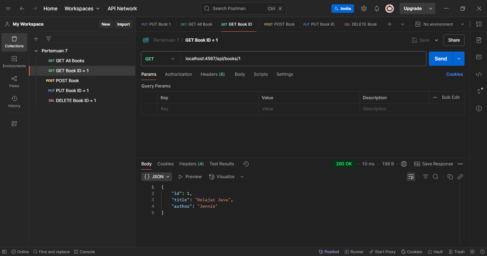
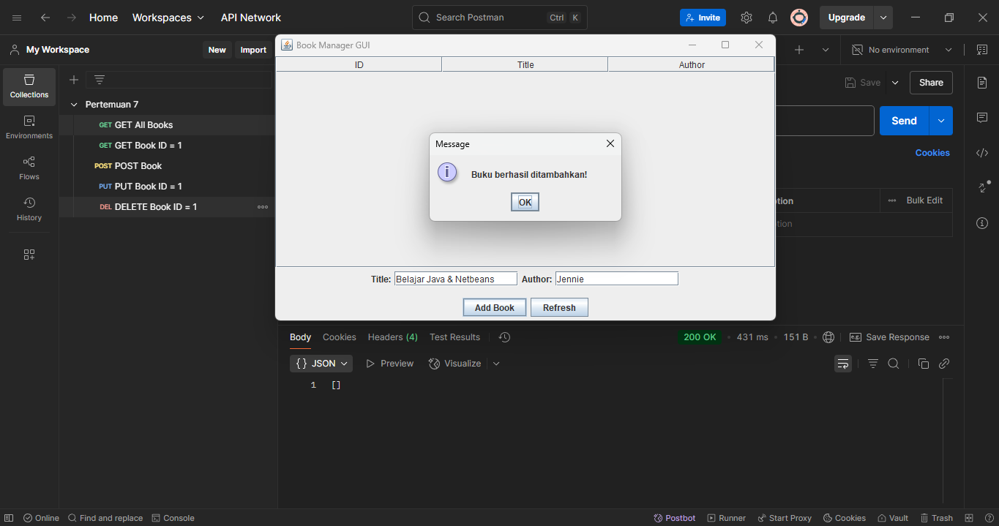

# Pertemuan 7 REST API Development

### Latihan 3 

Latihan 3 berisikan pembangunan sistem CRUD menggunakan Java dengan konsep REST API. Jika kita menjalan main class dari file itu maka kode ini akan berjalan, namun tidak memiliki tampilan apa apa, maka dari itu kita perlu menggunakan Postman untuk menguji coba API tersebut

### Latihan 4 

Latihan 4 merupakan hasil dari pengujian API menggunakan Postman, berikut merupakan pengujian dari masing masing fungsi yakni:

#### GET All Books:

#### GET Book ID = 1

#### POST Book

#### PUT Book ID = 1

#### DELETE Book ID = 1

### Latihan 5 

Latihan 5 merupakan kelanjutan dari latihan 3 dan 4 dimana kali ini kita dapat melihat interface secara langsung, jadi apa yang kita ubah pada REST API menggunakan Postman akan dapat dilihat di tampilan ini. Akan tetapi, kita tidak dapat menambah, menghapus, mengubah atau melakukan apapun pada tampilan ini dan perlu menjalankan ulang programnya untuk melihat perubahan yang telah dilakukan

#### Tampilan tanpa data

#### Data ditambah di dalam Postman

#### Tampilan setelah menambahkan data dengan Postman

### Latihan 6 

Pada Latihan 6, telah ditambahkan fitur baru yaitu refresh, maka dari itu kita tidak perlu menjalankan ulang jika ada terjadi perubahan dalam API. Hal ini dimungkinkan oleh function loadDataFromAPI(). Function itulah yang memungkinkan kita untuk me-refresh data API jika ada perubahan

#### Tampilan sebelum di refresh

#### Tampilan setelah di refresh

### Latihan 7 

Pada Latihan 7, kita akan coba membuat antarmuka untuk menambahkan data menggunakan API yang telah dibuat di LibraryApp.java nya. Kodenya dapat dilihat di src/main/java/com/pbo2/latihan7

Pada Latihan 7, ditambahkan fitur baru yaitu Add Book dimana kita dapat menambahkan data yang ada di Rest API menggunakan tampilan yang ada tanpa menggunakan Postman, selain itu ada 2 kolom baru untuk menambah Judul Buku dan Author

#### Sebelum Menambah Data

#### Proses Penambahan Data

#### Hasil Penambahan

### Tugas 

Pada bagian Tugas, ditambahkan 2 fitur terakhir yakni Delete dan Edit, dengan ditambahkannya 2 fungsi ini kita dapat melakukan GET, POST, PUT, dan DELETE, melalui tampilan tanpa menggunakan Postman 

#### Menambahkan Data
##### Tampilan Form Input  

##### Hasil Output setelah Submit  

#### Mengedit Data
##### Tampilan Sebelum Edit  

##### Tampilan Setelah Edit  

#### Menghapus Data
##### Konfirmasi Penghapusan  

##### Notifikasi Berhasil Dihapus  

##### Tampilan Setelah Data Dihapus  
